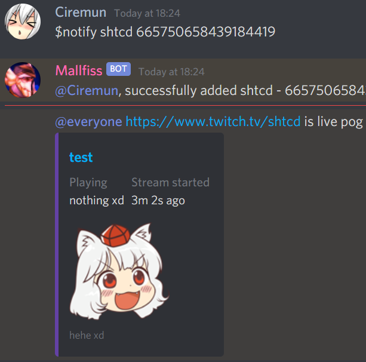

# shtcd discord bot

create, assign, delete discord server color roles  
configure twitch live notifications in discord announcement channels  

## Install

[Python 3](https://www.python.org/)

### env

|       Variable       |  Type  |                                        Value
|----------------------|--------|----------------------------------------------------------------------------------------------|
|`DISCORD_TOKEN`       | `str`  | discord bot token, [discord developer portal](https://discord.com/developers)                |
|`CLIENT_ID`           | `str`  | twitch application Client ID, create app in [twitch developer console](https://dev.twitch.tv/console/apps)                                                                                           |  
|`CLIENT_SECRET`       | `str`  | generate new secret in twitch dev console (under Client ID)                                  |
|`CLIENT_OAUTH`        | `str`  | user OAuth token, [twitchapps](https://twitchapps.com/tokengen/) helps obtain                |
|`APP_ACCESS_TOKEN`    | `str`  | server OAuth token [twitch docs](https://dev.twitch.tv/docs/authentication/getting-tokens-oauth#oauth-client-credentials-flow)  
|`CALLBACK_URL`        | `str`  | server URL to catch webhook requests                                                         |
|`SECRET`              | `str`  | secret used to sign notification payloads                                                    |
|`PORT`                | `int`  | flask application port                                                                       |
|`DEFAULT_MODERATOR_ID`| `int`  | default bot moderator                                                                        |
| `DATABASE_URL`       | `str`  | postgres [connection URIs](https://www.postgresql.org/docs/current/libpq-connect.html#LIBPQ-CONNSTRING) `postgres://{user}:{password}@{hostname}:{port}/{database-name}` |

### cfg.json

|     Key      |  Type  |                         Value                              |
|--------------|--------|------------------------------------------------------------|
| `prefix`     | `str`  | bot command prefix                                         |
| `embedHex6`  | `str`  | stream notification embed line color, six-digit HEX color  |
| `footerText` | `str`  | stream notification embed footer text                      |
| `rolesLimit` | `int`  | guild color roles limit                                    |
| `notify`     | `bool` | fetch and send notifications?                              |

## commands

|          Command          |            Description            |
|---------------------------|-----------------------------------|
| `colorinfo <#hex or rgb>` | get color image, rgb and hex      |
| `nocolor`                 | remove your color role            |
| `color <#hex or rgb>`     | get color role, replace if exists |
| `colors`                  | list created color roles          |
| `info`                    | uptime, channels, modlist         |

### moderators

|                       Command                           |               Description               |
|---------------------------------------------------------|-----------------------------------------|
|`nocolors`                                               | delete all color roles                  |
|`channel <channel_id>`                                   | add/remove bot channel                  |
|`notify <twitch username> <space separated channel IDs>` | add/remove/update twitch streams notify | 
|`mute <space separated mentions/userIDs>`                | add/remove "Muted" role                 | 
